<<<<<<< HEAD
📌 Lost and Found Portal
📖 Overview

The Lost and Found Portal is a full-stack web application designed to streamline the reporting, searching, and claiming of lost and found items within a community (e.g., campus or city). The system ensures secure access and provides a personalized experience based on user roles (Admin, Reporter, User).

🚀 Features

🔑 JWT-based Authentication – Secure login and role-based access control.

📝 Lost Item Reporting – Users can report lost items with details.

📸 Found Item Posting – Users can post items they’ve found.

🤖 Smart Match Suggestions – Suggests possible matches between lost and found items.

📂 Claim Management – Users can claim found items; claims go through admin verification.

👤 Role-based Access:
   Admin: Manage all users’ personal details and oversee portal activity.
   Reporter: Manage reported items and user data related to reporting.
   User: Report lost items, post found items, and claim found items.

 📊 Admin Dashboard – View/manage users, lost items, found items, and claims

🛠️ Tech Stack

Frontend: Angular, HTML, CSS

Backend: Spring Boot, Java

Database: MySQL

API: REST API

📌 Modules

Lost Item Reporting – Report and track missing items.

Found Item Posting – Post and manage found items.

Smart Match Suggestions – Automatic suggestions for matching lost & found items.

Claim Management – Handle claims for found items with admin approval.

Security: JWT Authentication, Role-Based Access Control

## ⚙️ Installation / Setup Instructions

Follow these steps to set up and run the project on your local machine.

### 1. Clone the repository
```bash
git clone https://github.com/aminaminnu/LostAndFoundPortal.git
cd LostAndFoundPortal


## Project Structure
LostAndFoundPortal/
├── backend/        # Spring Boot application
│   ├── src/        # Java source code
│   ├── pom.xml     # Maven dependencies
│
├── frontend/       # Angular application
│   ├── src/        # Angular source code
│   ├── package.json
│
└── README.md       # Project documentation

## 📸 Screenshots  

### 🏠 Home Pages  
  
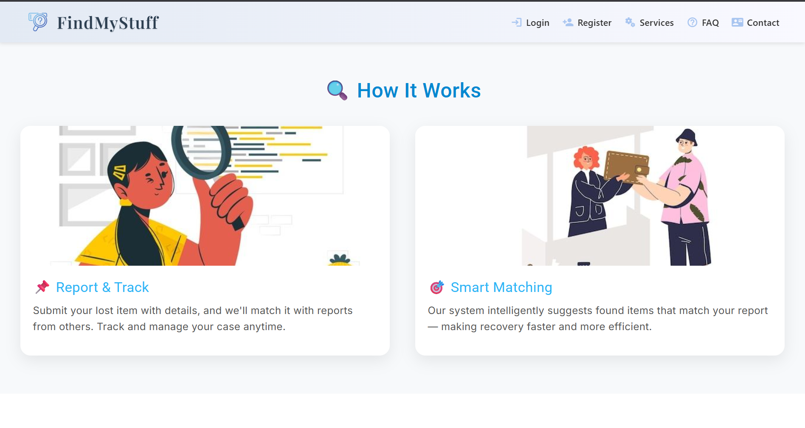  
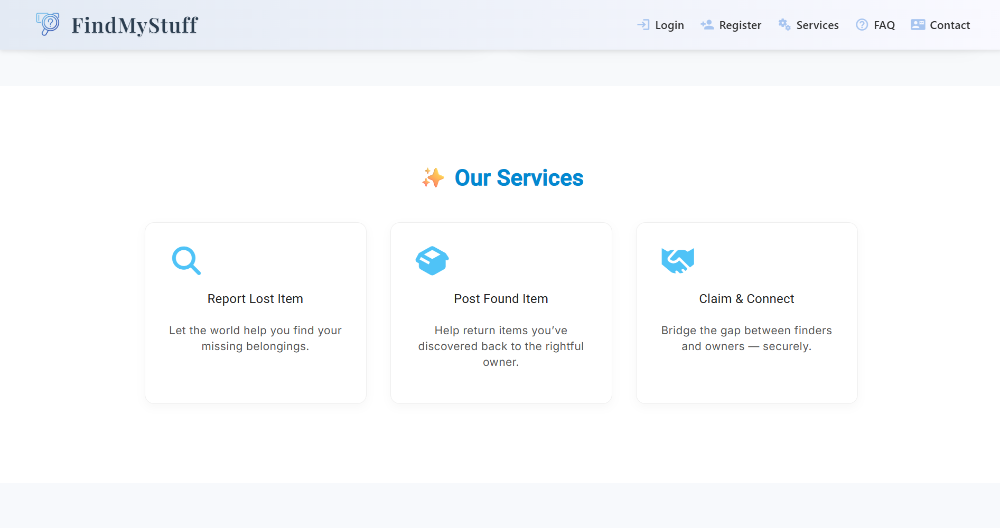  
  
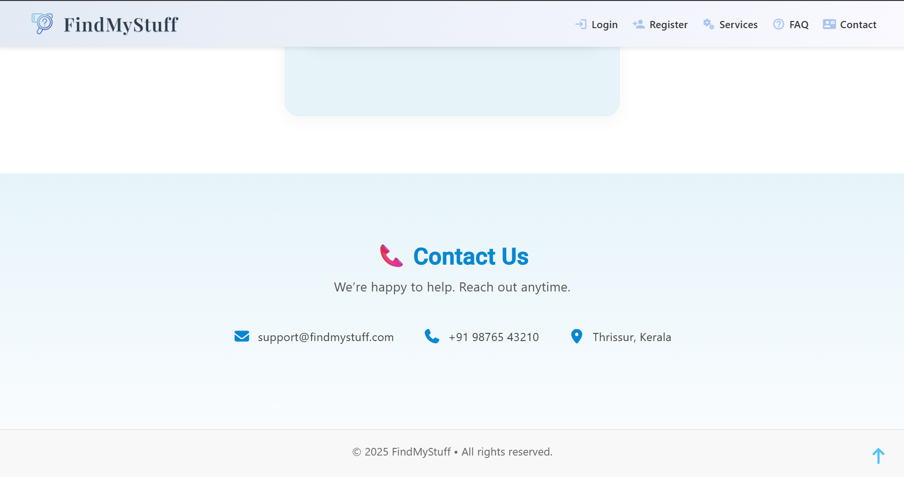  

### 🔑 Login Page  
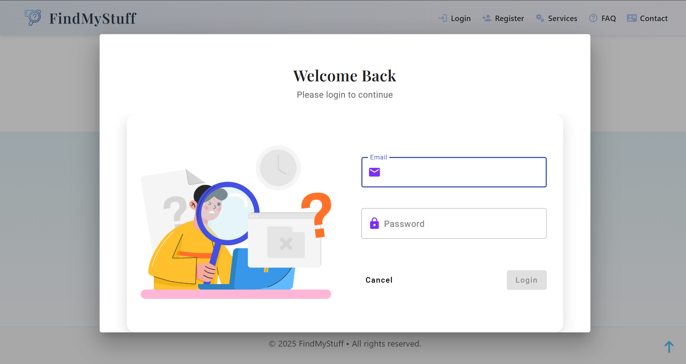  

### 📝 Finder  
- Finder Form  
  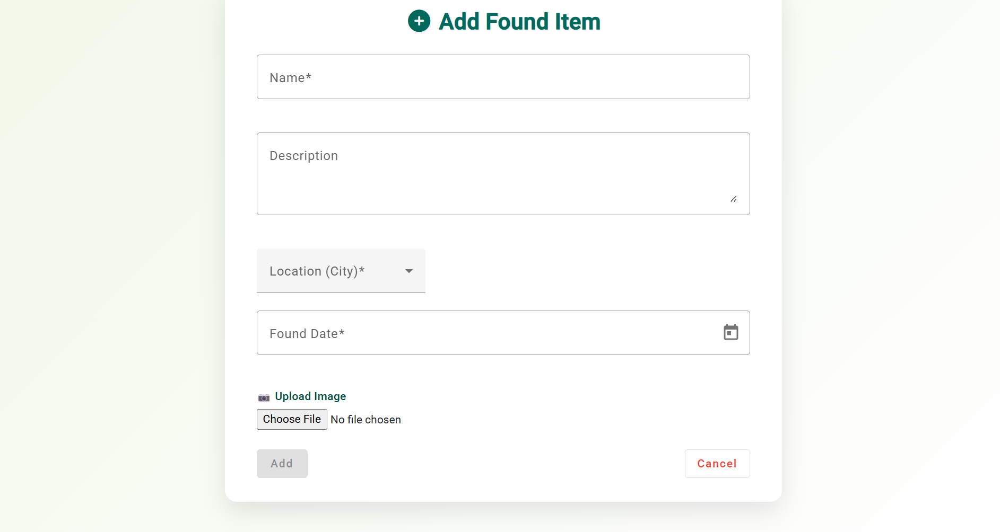  
- Finder Home  
  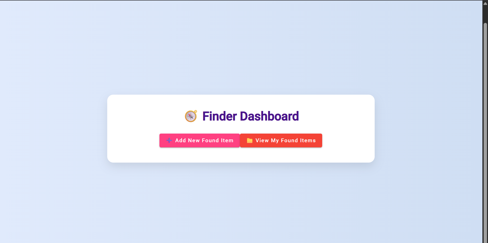  
- Finder List  
  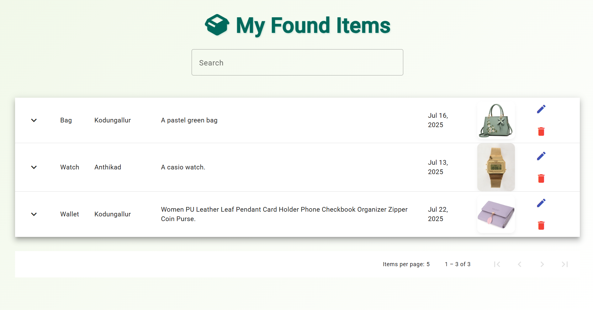  

### 🛠️ Admin Dashboard  
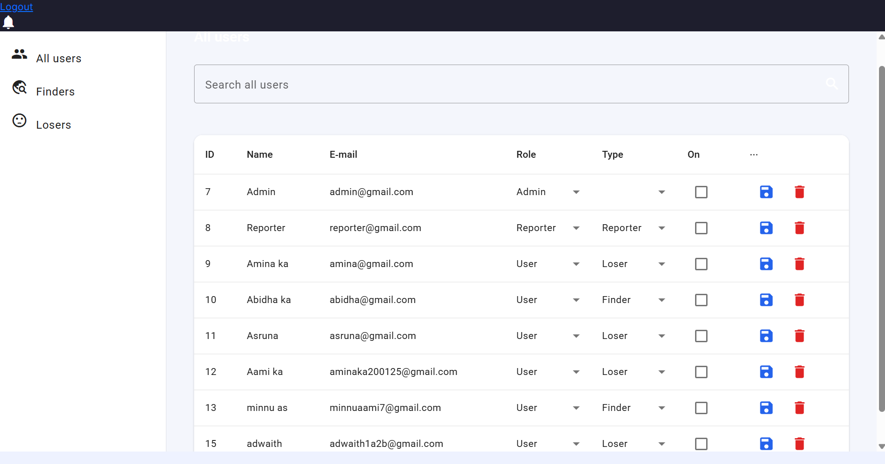  

### 🙍 Loser Pages  
- Loser Home  
    
- Loser Claim  
  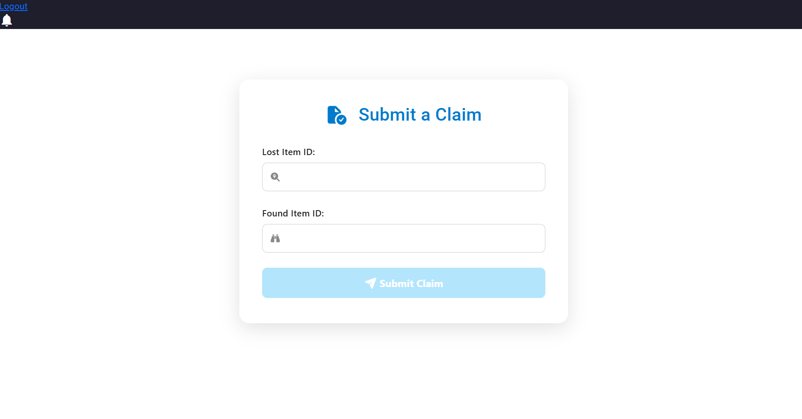  
- Loser Form  
  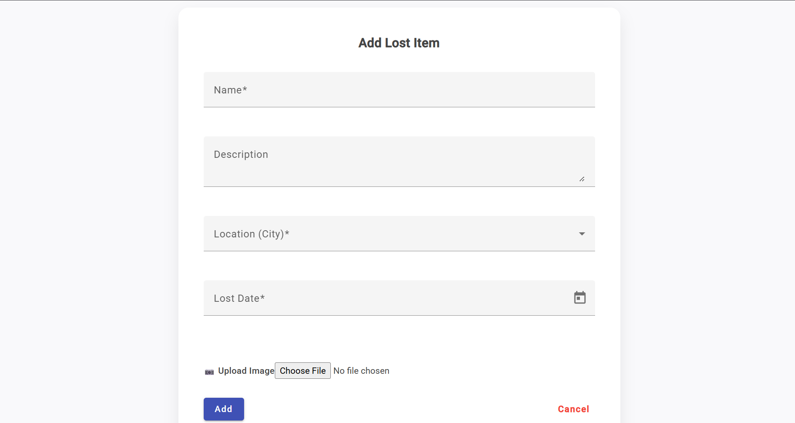  

### 📂 Losing List  
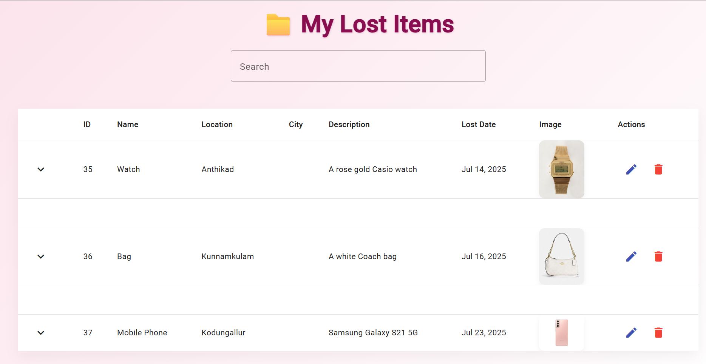  

### 📝 Register Page  
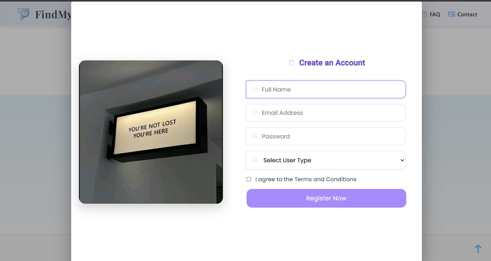  

### 📊 Reporter Dashboard  
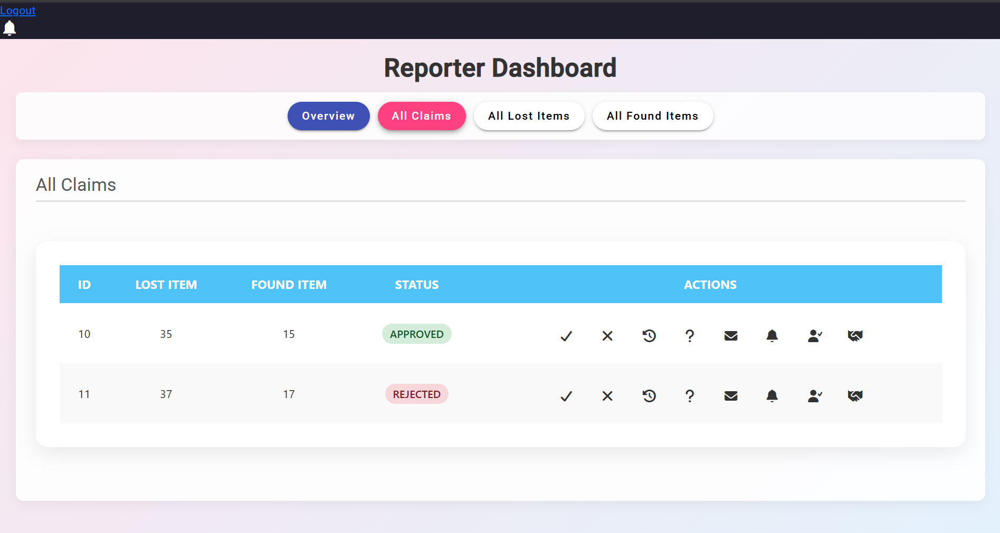  


>>>>>>> e4e45d6 (Initial commit with Angular frontend ans spring Boot backend)
